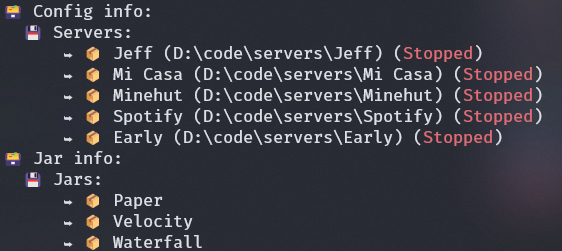

# 📦 Boxes `v0.1.x`

Heyo! I made a cool CLI to manage servers locally and externally. Like it? Consider adding that cool little ⭐. 

## Description
Boxes is a tool designed to manage Minecraft servers locally. It provides a convenient way to start, stop, and configure Minecraft servers on your local machine. With Boxes, you can easily create and manage multiple server instances, *install plugins* (WIP), and customize server settings. Whether you're a Minecraft enthusiast or a server administrator, Boxes simplifies the process of running Minecraft servers locally, allowing you to focus on enjoying the game or managing your community!

This tool only supports **Windows** and **MacOS (With Cargo)** unless you build your own version by cloning the repository.

## Installation

### Easiest method (Requires cargo)

1. Run `cargo install boxes`
2. Enjoy :)

### Second method

1. Install the latest stable `.exe` from [here](https://github.com/Azuyamat/Boxes/releases/latest)
2. Place the `.exe` under a `Boxes` folder in your `Program Files`
3. Add the path to the parent directory of the `.exe` to the environment variables
4. Run the `.exe` in your terminal or simply write `boxes` if you did steps 2 & 3
5. Enjoy :)

## Usage

> All commands are pre-fixed with `boxes`

### Default commands

Create a server:

`create <SERVER NAME> <JAR NAME> <LOCATION> <VERSION> [BUILD]`

Start a server:

`start <SERVER NAME>`

View config (Not much here yet):

`config info`

### Server commands

> All commands below are pre-fixed with `boxes server`

List all servers verbosely:

`list <SERVER NAME>`

Generate a server using a quick and handy "questionnaire":

`generate`

Get info about a server:

`info <SERVER NAME>`

Start a server:

`start <SERVER NAME>`

Delete a server (CAUTION):

`delete <SERVER NAME>`

Add an existing server:

`add <LOCATION>`

Manage plugins (WIP):

`plugins <SERVER NAME>`

Assign an IP to a server:

`assign-ip <SERVER NAME> <IP>`

## License

This product is available under the [MIT licence](https://opensource.org/licenses/MIT).